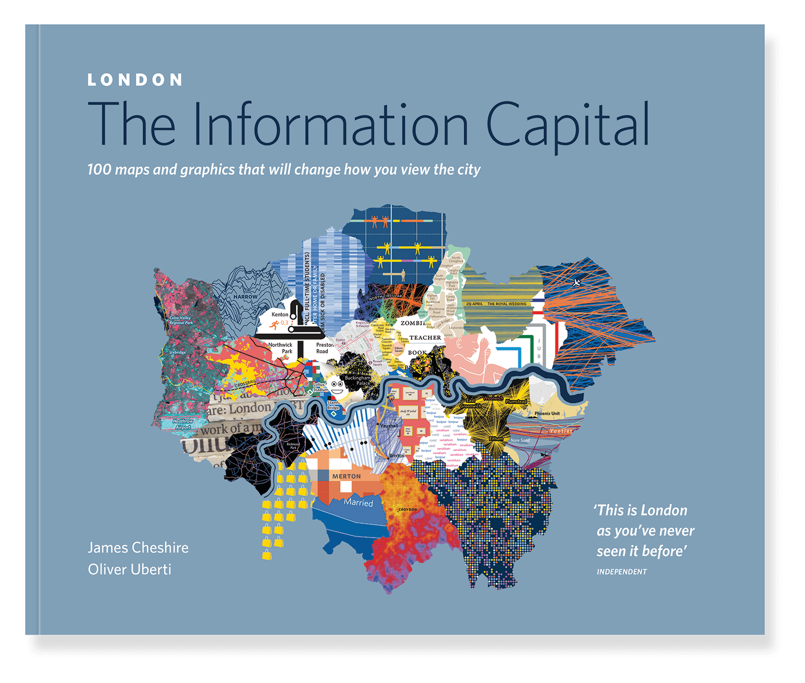

# Mapping London {.unnumbered}

## Why London?
It is an exciting time to be a quantitative geographer in London. The city is generating more data for us to work with than ever before. Maps, graphics and infographics about the city are everywhere more people live here than at any time in London’s history. A great example of the variety of data that is available for London is captured in the book [London: The Information Capital](https://www.oliveruberti.com/the-information-capital) by [James Cheshire](https://jcheshire.com/) and [Oliver Uberti](https://www.oliveruberti.com/). As geographers, we are in a critical position both to be able to capitalise on these developments for our own research but also view them a little more critically than others who have not had the benefit of decades of social and spatial research.

```{r} 
#| label: fig-london-information-capital
#| fig.cap: "London: The Information Capital by Professor [James Cheshire](https://jcheshire.com/) and [Oliver Uberti](https://www.oliveruberti.com/the-information-capital)"
#| echo: FALSE

```

The application of quantitative research methods to data about the "real-world" is at the heart of this exercise. All data are collected at a single point in time and so may become out of date, or they may be too generalised to capture the minutiae of an area. Such limitations are not as significant as they once were since we now have access to data in more detail than ever before, but this does not relinquish the need to get a sense for the broader context of the study area. 
