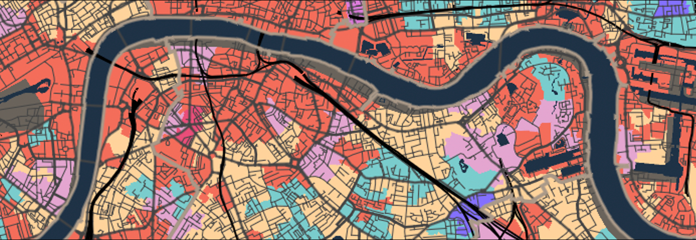

# Mapping London Tutorial

```{r} 
#| label: gif-welcome
#| echo: FALSE

```

## An abundance of data
It is an exciting time to be a quantitative geographer in London. The city is generating more data for us to work with than ever before. Maps, graphics and infographics about the city are everywhere more people live here than at any time in London’s history. As geographers, we are in a critical position both to be able to capitalise on these developments for our own research but also view them a little more critically than others who have not had the benefit of decades of social and spatial research.

The application of quantitative research methods to data about the *real-world* is at the heart of this exercise. All data are collected at a single point in time and so may become out of date, or they may be too generalised to capture the minutiae of an area. Such limitations are not as significant as they once were since we now have access to data in more detail than ever before, but this does not relinquish the need to get a sense for the broader context of the study area.

::: {.callout-note}
A great example of the variety of data that is available for London is captured in the book [London: The Information Capital](https://www.oliveruberti.com/the-information-capital) by [James Cheshire](https://jcheshire.com/) and [Oliver Uberti](https://www.oliveruberti.com/). 
::: 

## Lecture notes 
The slides for this week's lecture can be downloaded here [[Link]]().

## This week
This week we will be mapping **crime hotspots** in the London boroughs of [Camden](https://www.google.com/maps/place/London+Borough+of+Camden,+London/@51.5428102,-0.1944449,13z/data=!3m1!4b1!4m5!3m4!1s0x48761aec186b9a3d:0x41185c626be66e0!8m2!3d51.5454736!4d-0.1627902?hl=en) and [Islington](https://www.google.com/maps/place/London+Borough+of+Islington,+London/@51.5470193,-0.1444663,13z/data=!3m1!4b1!4m5!3m4!1s0x48761b5dedeb3be5:0x54f085cb18ec65c9!8m2!3d51.5465063!4d-0.1058058?hl=en). The data we will be working with for this week's task are downloaded from the [data.police.uk](https://data.police.uk/) website. 

::: {.callout-warning}
You are expected to work through the following computer tutorial individually, but you will submit this week's worksheet as a **group**.
:::

